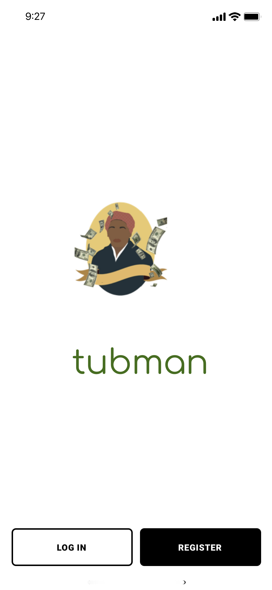

<!--
*** Thanks for checking out the Best-README-Template. If you have a suggestion
*** that would make this better, please fork the repo and create a pull request
*** or simply open an issue with the tag "enhancement".
*** Thanks again! Now go create something AMAZING! :D
***
***
***
*** To avoid retyping too much info. Do a search and replace for the following:
*** tonioshikanlu, tubman-hack, toni_osh, toni.oshikanu9@gmail.com, Tubman, This application is a trading platform that is built to foster mentorship, community and education among the black community.


-->


<!-- PROJECT SHIELDS -->
<!--
*** I'm using markdown "reference style" links for readability.
*** Reference links are enclosed in brackets [ ] instead of parentheses ( ).
*** See the bottom of this document for the declaration of the reference variables
*** for contributors-url, forks-url, etc. This is an optional, concise syntax you may use.
*** https://www.markdownguide.org/basic-syntax/#reference-style-links
-->
[![Contributors][contributors-shield]][contributors-url]
[![Forks][forks-shield]][forks-url]
[![Stargazers][stars-shield]][stars-url]
[![Issues][issues-shield]][issues-url]
[![MIT License][license-shield]][license-url]
[![LinkedIn][linkedin-shield]][linkedin-url]


<!-- PROJECT LOGO -->
<br />
<p align="center">
  <a href="https://github.com/tonioshikanlu/tubman-hack">
    
  </a>

  <h3 align="center">Tubman</h3>

  <p align="center">
    This application is a trading platform that is built to foster mentorship, community and education among the black community.

  </p>
</p>


<!-- TABLE OF CONTENTS -->
<details open="open">
  <summary><h2 style="display: inline-block">Table of Contents</h2></summary>
  <ol>
    <li>
      <a href="#about-the-project">About The Project</a>
      <ul>
        <li><a href="#built-with">Built With</a></li>
      </ul>
    </li>
    <li>
      <a href="#getting-started">Getting Started</a>
      <ul>
        <li><a href="#prerequisites">Prerequisites</a></li>
        <li><a href="#installation">Installation</a></li>
      </ul>
    </li>
    <li><a href="#roadmap">Roadmap</a></li>
    <li><a href="#contributing">Contributing</a></li>
    <li><a href="#license">License</a></li>
    <li><a href="#contact">Contact</a></li>
    <li><a href="#acknowledgements">Acknowledgements</a></li>
  </ol>
</details>


<!-- ABOUT THE PROJECT -->
## About The Project

<a href="https://github.com/tonioshikanlu/tubman-hack">
    
  </a>

This application is a trading platform that is built to foster mentorship, community and education among the black community.

### Problem

We found out through research was that the black community severely lags behind the white community when it comes to participation in the stock market. This has led to an expansive wealth gap between the two communities which we hope our solution can help reduce. The black community lacks the adequate tools, knowledge and generational mentorship to succeed in the financial markets. In addition to the fact that most brokerage platforms are not truly free as they either sell the user data to bigger hedge funds for leverage or give these bigger instituitons the power to execute their user's trades for revenue. This shows how the current market really only exists to serve the top 1%. 

### Solution

Tubman is a truly free market brokerage platform that is made for the people by the people and is specifically aimed at building community, fostering mentorship and education among the black community. This will help in the upskilling of this community which has previously shied away from the markets because of fear and lack of knowledge. 

### Features

* Portfoilio Management
* Direct Trade execution on the Free Market
* One on one mentor matching and connections
* Sub-Communities for like minded investors to meet and discuss
* Paper Trading
* IOS/Android Integration
* Free Learning tools through various investment courses
* Follow prmoinenet black traders and emulate their strategies 

### Built With

* Java (android version)
* Swift UI (iOS version)
* Firebase (database integration)
* Figma (app prototypes)

### Demo
[Video Link](https://youtu.be/wcEXKxaM0ek)
[Pitch Presentation](https://www.beautiful.ai/player/-MWAtFR5AfVTjf_JBkcW)


<!-- GETTING STARTED -->
## Getting Started

To get a local copy up and running follow these simple steps.

### Prerequisites

This is an example of how to list things you need to use the software and how to install them.
* npm
  ```sh
  npm install npm@latest -g
  ```

### Installation

1. Clone the repo
   ```sh
   git clone https://github.com/tonioshikanlu/tubman-hack.git
   ```
2. Install NPM packages
   ```sh
   npm install
   ```


<!-- ROADMAP -->
## Roadmap

See the [open issues](https://github.com/tonioshikanlu/tubman-hack/issues) for a list of proposed features (and known issues).


<!-- CONTRIBUTING -->
## Contributing

Contributions are what make the open source community such an amazing place to be learn, inspire, and create. Any contributions you make are **greatly appreciated**.

1. Fork the Project
2. Create your Feature Branch (`git checkout -b feature/AmazingFeature`)
3. Commit your Changes (`git commit -m 'Add some AmazingFeature'`)
4. Push to the Branch (`git push origin feature/AmazingFeature`)
5. Open a Pull Request


<!-- LICENSE -->
## License

Distributed under the MIT License. See `LICENSE` for more information.


<!-- CONTACT -->
## Contact

Repo Owner - [@toni_osh](https://twitter.com/T_Oshikanlu) - toni.oshikanu9@gmail.com

Project Link: [https://github.com/tonioshikanlu/tubman-hack](https://github.com/tonioshikanlu/tubman-hack)


<!-- ACKNOWLEDGEMENTS -->
## Acknowledgements

* Howard University SOB for setting up the Bison Hacks Hackathon! 
* All the sponsors!
* Accenture for their challange inspiration!
* Fiserv for their challange inspiration!


<!-- MARKDOWN LINKS & IMAGES -->
<!-- https://www.markdownguide.org/basic-syntax/#reference-style-links -->
[contributors-shield]: https://img.shields.io/github/contributors/tonioshikanlu/tubman-hack.svg?style=for-the-badge
[contributors-url]: https://github.com/tonioshikanlu/tubman-hack/graphs/contributors
[forks-shield]: https://img.shields.io/github/forks/tonioshikanlu/tubman-hack.svg?style=for-the-badge
[forks-url]: https://github.com/tonioshikanlu/tubman-hack/network/members
[stars-shield]: https://img.shields.io/github/stars/tonioshikanlu/tubman-hack.svg?style=for-the-badge
[stars-url]: https://github.com/tonioshikanlu/tubman-hack/stargazers
[issues-shield]: https://img.shields.io/github/issues/tonioshikanlu/tubman-hack.svg?style=for-the-badge
[issues-url]: https://github.com/tonioshikanlu/tubman-hack/issues
[license-shield]: https://img.shields.io/github/license/tonioshikanlu/tubman-hack.svg?style=for-the-badge
[license-url]: https://github.com/tonioshikanlu/tubman-hack/blob/main/LICENSE
[linkedin-shield]: https://img.shields.io/badge/-LinkedIn-black.svg?style=for-the-badge&logo=linkedin&colorB=555
[linkedin-url]: https://www.linkedin.com/in/oluwatoni-oshikanlu-2a20b957/
